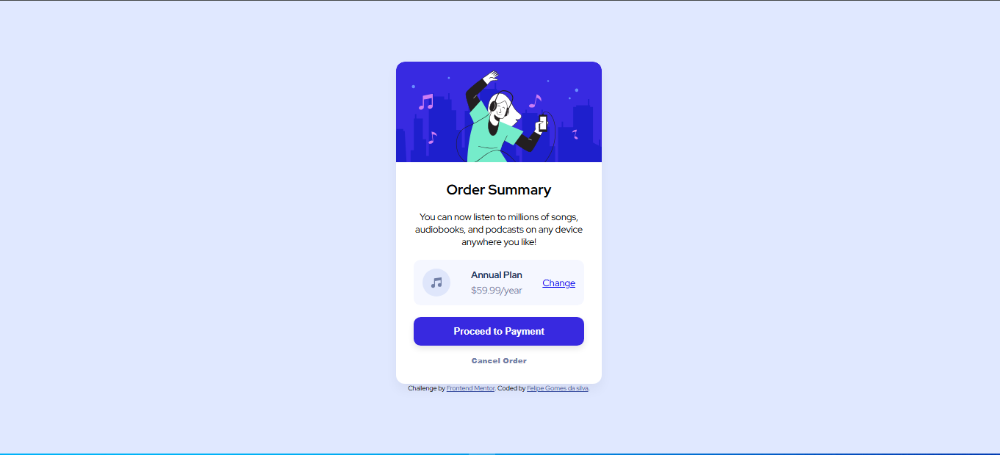

# Order Summary Component

Este é um projeto desenvolvido como desafio do [Frontend Mentor](https://www.frontendmentor.io). O objetivo principal foi criar um componente de resumo de pedido, exercitando habilidades de estruturação HTML, estilização CSS e uso de recursos como Flexbox e SVGs.

## 🚀 Tecnologias Utilizadas

- HTML5
- CSS3 (Flexbox)
- Mobile-first workflow

## 💡 O que aprendi neste desafio

- **Estruturação:** Organização de elementos dentro de um card container.
- **Estilização:** Criação de estados de hover para botões e transições suaves.
- **Manipulação de SVG:** Integração de ícones vetoriais de forma eficiente.
- **Responsividade:** Ajustes de layout para diferentes tamanhos de tela.

## 📸 Pré-visualização

## 🔗 Como visualizar

Podes acessar o projeto final através deste link: https://felipegdasilva.github.io/Order-summary-card/
